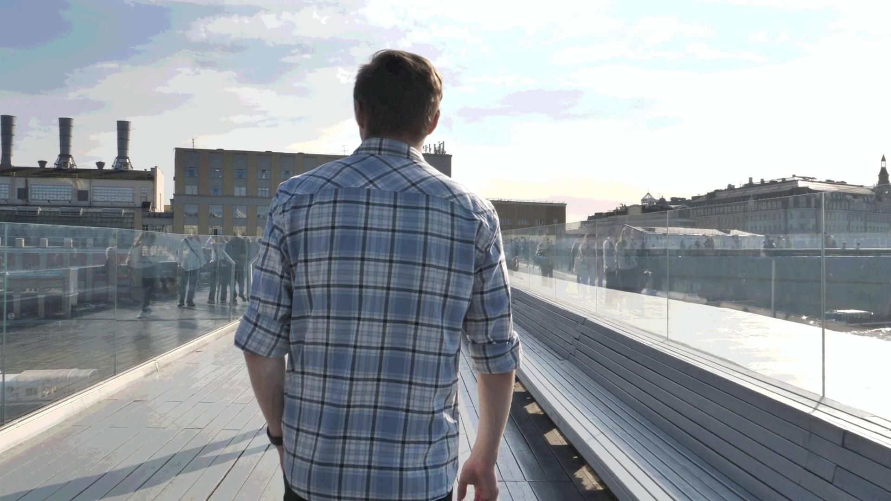

# Next Gen Video AI Unlocking Efficiency with Psychovisual Perception Models
Perception-aware video inference for computer vision. This repo explores how to cut compute and memory by ignoring redundant, non-salient frames and features, aligning models with what humans reliably perceive. Goal: faster, lighter, more robust video recognition with fewer errors from unlabeled, irrelevant stimuli.


## At a Glance
We filter non-perceptible spatiotemporal content before training/inference, guided by human contrast sensitivity and retinal receptor distribution. Results: ~15% dataset redundancy reduction and ~3.5% mean accuracy gain across diverse detectors, with faster convergence and lower resource use. 

---

## Why perception-aware?
Videos contain lots of content people **don’t actually see** at normal viewing conditions. Penalizing models for unlabeled, irrelevant stimuli adds compute and error. We apply a psychovisual weighting that emphasizes centrally perceived motion/structure while down-weighting imperceptible frequencies—yielding simpler, more “human-like” inputs. 

**Method sketch.** We estimate motion + region-of-interest, apply spatiotemporal contrast sensitivity within ROI and a peripheral falloff tied to photoreceptor density, then invert to a CV-friendly frame. (See paper for equations and pipeline diagram.)


---


## Dataset
- Source: RED Komodo 6K captures → 1080p (1920×1080), 25 fps; H.264 for delivery.
- Annotations: 6,257 boxes (person 2,787; vehicle 3,470) over 1,080 frames.
- Two training sets: **Dataset 1 (unfiltered)**, **Dataset 2 (perception-filtered)**
- one independent unseen test video to test the model on  

## Dataset Preview

Here are sample frames from both datasets:

### Dataset 1 – Unfiltered
| Frame 1 | Frame 2 | Frame 3 | Frame 4 | Frame 5 | Frame 6 |
|---------|---------|---------|---------|---------|---------|
|  |  |  |  |  |  |

### Dataset 2 – Perception-Filtered
| Frame 1 | Frame 2 | Frame 3 | Frame 4 | Frame 5 | Frame 6 |
|---------|---------|---------|---------|---------|---------|
|  |  |  |  |  |  |

> Note: If you're interested in the full annotated dataset please contact me at [Rogers10@student.eit.ac.nz](mailto:Rogers10@student.eit.ac.nz).


---

## Method & Baselines


All test were done on google colab using the Tesla T4 GPU 

- **HOG+SVM (no pretraining)**
- **CNN from scratch (lightweight)**
- **YOLOv8**, **YOLOv11** (modern one-stage)
- **Faster R-CNN** (two-stage)
- **RF-DETR** (transformer)
Each baseline probes a different dependency on context/periphery; the filtered data exposes redundancies and helps most models converge faster with better mAP.

### Why these algorithms?

- **HOG+SVM (classical, no pretraining):**  
  A strong, transparent baseline that captures local edge/gradient cues — and mirrors early human visual processing — without any large-scale pretraining. It reveals how much signal the preprocessing alone contributes.  

- **Lightweight CNN from scratch:**  
  Isolates the effect of simplified visual input on representation learning when no external priors are used. Good for showing convergence and stability boosts.  

- **YOLOv8 / YOLOv11 (modern one-stage detectors):**  
  Stress-test perception-aware preprocessing under fast, real-time oriented pipelines that often rely on contextual/peripheral cues — the method exposes and trims redundancy here.  

- **Faster R-CNN (two-stage detector):**  
  Complements YOLO by examining region proposal behavior under simplified frames; useful for evaluating mAP@0.5 and mAP@0.5:0.95.  

- **RF-DETR (transformer-based):**  
  Tests global attention under reduced peripheral clutter; demonstrates that removing imperceptible content can improve transformer detection quality and efficiency.  

---

**Empirical headline:**  
Psychovisual preprocessing reduced dataset redundancy (~15%) and improved average prediction accuracy by **~3.5%**, while also speeding convergence and lowering compute across all tested models.  


---

## Results (high level)
Across all models, training on the **perception-filtered** set improved accuracy and reduced inference cost. Average gain ≈ **+3.5%** with faster convergence and lower memory usage; see paper figs/tables for details. 


---

## Quickstart

### 1) Environment
```bash
# Python 3.11 recommended

